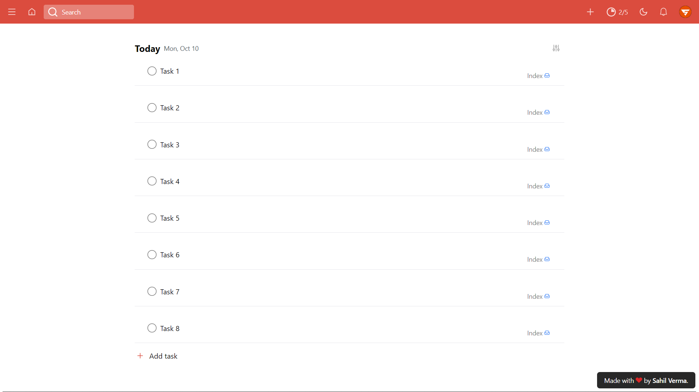
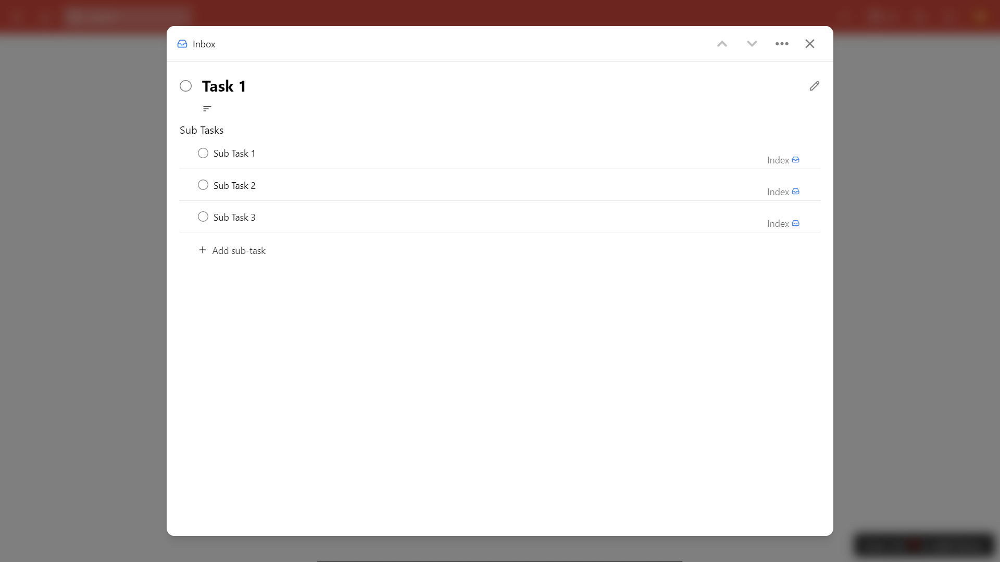
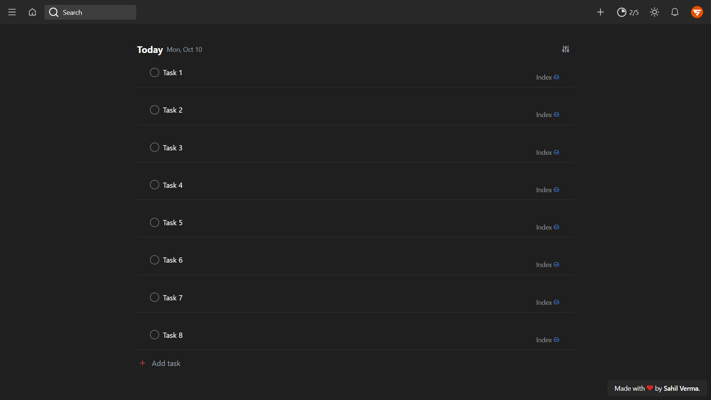
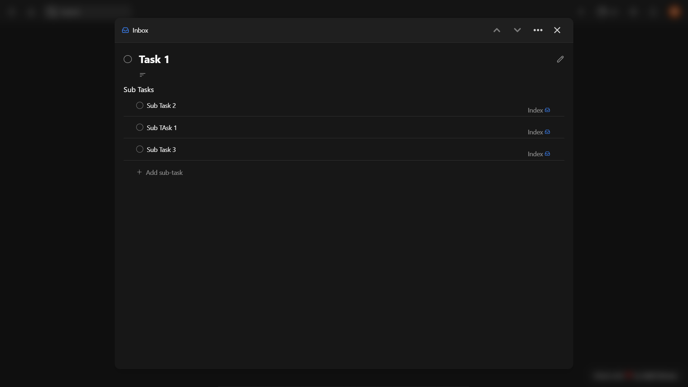
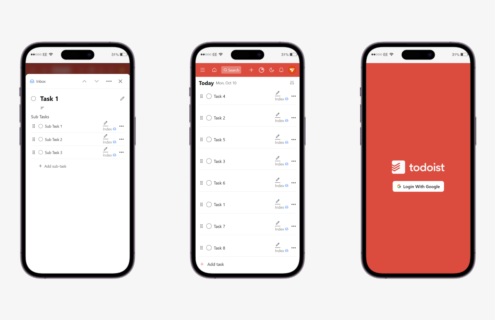
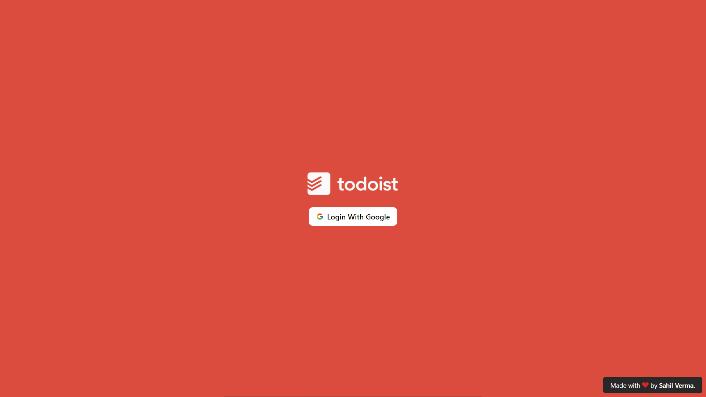
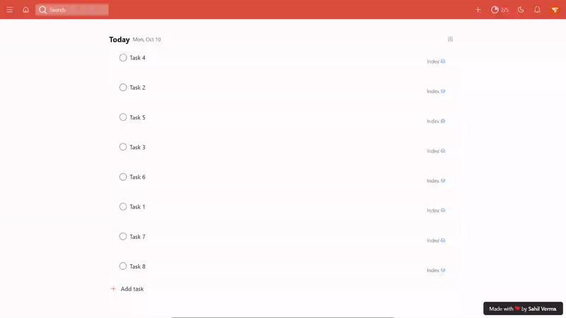
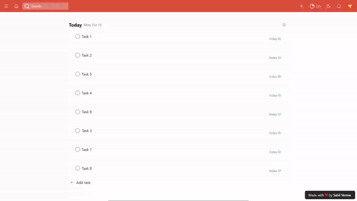

# Todoist Firebase

Todoist Firebase is Todoist Clone made with React JS and Firebase. This tools will help you to organize your life and works and maintain the tasks you want to performed in upcoming time.

## Live Website URL

https://todoist-firebase.vercel.app/

## How to setup

1. Clone the reposetry to your system.

```bash
  git clone https://github.com/theviralboy/todoist-firebase
```

2. Change the directory to the **todoist-firebase**.

```bash
  cd todoist-firebase
```

3. Install all the packages.

```bash
  npm i # or yarn install if you're using yarn
```

4. Open the VS Code in the this folder.

```bash
  code .
```

5. Create **.env** file according to the **.env.example** file with your Firebase credentials.
6. Go to the **[Firebase](https://firebase.google.com/)** and create a new project.
7. Copy and paste the credentials on the **.env** file.
8. Enable **Firestore** and **Authentication**.
9. Select **Google Authentication** on the **Authentication services**.
10. Now start the server.

```bash
  npm start # or yarn start if you're using yarn
```

## Screenshots

### Light Theme

#### Home



#### Task



### Dark Theme

#### Home



#### Task



## Features

### Responsive Design



### User Authentication



### Dark Theme Toggle



### Task Dragging



## Tech Stack

React JS, Tailwind CSS, Framer Motion, Firebase 9.

## Feedback

If you have any feedback, please reach out to us at sahilverma.webdev@gmail.com
